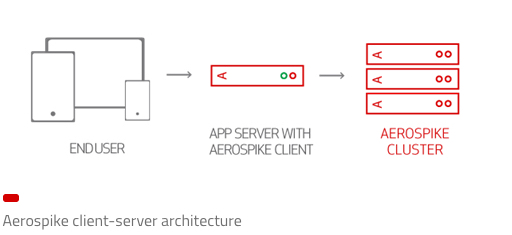
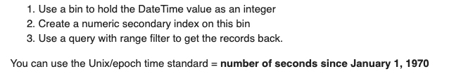

# airospike

## 安装airospike
- https://codeday.me/bug/20190607/1195654.html （docker安装以及主机连接）

## airospike简介
1. 创建namespace
	- 需要修改配置文件(/etc/aerospike/aerospike.conf)，然后重启aerospike
	- 对于docker来说，增加-e "NAMESPACE=mars_ursprf"
2. 架构
	
	- 客户端层
	
## 数据模型
1. aerospike不像关系型数据库的数据模型，可以随时增加一列数据类型到记录中,bin的数据类型根据其值来动态的定义，十分的灵活，没有类似于mysql表结构的schema，甚至可以把一个string类型的bin，修改为int类型。
2. bins可以创建二级索引，如果一个bin被一个应用存储了string类型的数据，被另一个应用存储了int类型的数据，那么int类型的索引不包含string值的记录，反之依然；[参考](https://www.aerospike.com/docs/architecture/secondary-index.html)
3. 可以指定多个命名空间，且命名空间的策略均可以不一样，例如ns1存储在ssd，ns2存储在DRAM.

## 客户端架构


1. 客户端能够跟踪集群的状态，维护集群列表
2. 无须自己维护连接池
3. 线程安全，一个进程中只有一个实例

## 相关概述
1. Aerospike是面向行的数据库，其中每条记录（相当于关系数据库中的一行）均由键唯一标识。记录的键及其其他元数据位于主索引中。记录的数据保存在其占用的命名空间的预定义存储设备中。
2. key-value存储
	- Aerospike是schemaless，不必预先定义集合（相当于关系数据库中的表）或bin（相当于关系数据库中的列）。sets和bins由应用程序实时创建，因为它对Aerospike执行写操作
3. 一致性
	- 写入不会丢失：对单个记录的所有写操作将以特定顺序（顺序）应用，并且写操作不会重新排序或跳过，即不会丢失。
4. [策略](https://www.aerospike.com/docs/guide/policies.html)

	```
	clientPolicy.readPolicyDefault.replica = Replica.MASTER_PROLES;
	clientPolicy.readPolicyDefault.consistencyLevel = ConsistencyLevel.CONSISTENCY_ALL;
	clientPolicy.readPolicyDefault.socketTimeout = 100;
	clientPolicy.readPolicyDefault.totalTimeout = 100;
	clientPolicy.writePolicyDefault.commitLevel = CommitLevel.COMMIT_ALL;
	clientPolicy.writePolicyDefault.socketTimeout = 500;
	clientPolicy.writePolicyDefault.totalTimeout = 500;
	```

## 调研golang-airospike连接
1. Go version v1.9+ is required
2. 连接
	- Use the Aerospike Go client to connect and periodically ping nodes for cluster status by creating a Client object to specify the IP address and port of one or more cluster seed nodes.（会定期ping集群中的节点）
	- When creating a new Client object, specify the server to connect to using the IP address and port. The client makes initial contact with the specified server, then automatically discovers all other cluster nodes.（对于多节点的情况，go-client只需要连接单节点的aerospike,go-cleint会自动发现其他节点）
	
		```
		import as "github.com/aerospike/aerospike-client-go"

		client, err := as.NewClient("127.0.0.1", 3000)
		```
	- To connect to any node in the cluster, specify each node in the cluster when creating the client. The client iterates through the array of nodes until it successfully connects to a node, then it discovers the other cluster nodes.(go-client遍历每一个节点知道成功连接到其中一个，然后就能够发现集群中其他的节点)
		
		```
		import as "github.com/aerospike/aerospike-client-go"

		hosts := []*Host {
		       as.NewHost("a.host", 3000),
		    as.NewHost("another.host", 3000),
		    as.NewHost("and.another.host", 3000),
		}
		
		client, err := as.NewClientWithPolicyAndHost(nil, hosts...)
		```
	- The NewClient initializer creates a maintenance goroutine to periodically ping nodes for cluster status. The Client instance is goroutine friendly and can be used concurrently.(go-client会定期的ping节点)
	- Each get/set call is a non-blocking, asynchronous network call to the Aerospike database cluster. Connections are cached with a connection pool for each server node.（每个get/set调用都是异步的，连接对于每一个节点采用连接池的方式。）
	- 关闭：When all transactions complete and the application is ready for a clean shutdown, call the Close() method to free resources held by the Client object. The Client object cannot be used after a Close() call.（应用关闭前，需要Close(）释放资源）
3. 关于断开连接
	- 1.测试启动了应用项目后，初次访问aerospike成功。
	- 2.关闭aerospike，测试应用接口，访问aerospike失败。
		
		```
		command execution timed out on client: Exceeded number of retries. 
		See `Policy.MaxRetries`. (last error: Cluster is empty.)
		```
	- 3.重新启动aerospike，再次测试接口，访问成功。
	- 4.备注：应用只用了一个Client连接aerospike，官方也推荐只用一个Client。且Client会定时ping一下服务端，保持活跃。
4. 默认get策略:
	- https://github.com/aerospike/aerospike-client-go/blob/master/docs/policies.md
5. 批量处理
	- Internal to the Aerospike Go client, this call groups keys based on which Aerospike server node can best handle the request, and uses multiple goroutines to concurrently handle the requests to all nodes. After all nodes have returned the record data, the records return to the caller. The array of records that returns is in the same order as the key passed in.
		- 官方强调（best handle the request!!!），考虑程序上改用此方式
		- 启动多个协程处理
		- 所有协程返回后，整个调用才返回
6. 关于多操作（类似事务）
	- Use the Aerospike Go client to modify and read multiple records in a single transaction (that is, atomic modification).（原子操作！）
	
		```
			record, err := client.Operate(policy, key, as.AddOp(bin3), 
   			as.PutOp(bin4), as.GetOp())
		```
7. 官方推荐最佳实践（https://www.aerospike.com/docs/client/go/usage/best_practices.html）
	- 在应用中使用一个Client对象
	- 限制连接池大小，默认为最大连接为256。
	- 客户端缓冲区，减少内存消耗
		- 不要增加缓冲区大小。初始缓冲区大小足以执行大多数操作（默认值为16KiB）
		- pool默认有512个buffers
		- buffer是有限制的，不要超过限制(默认128k)
	- 大部分情况下，使用默认值即可。以下情况可能会影响性能：
		- 初始缓冲区太小，最终缓冲区太大（对于每一次操作来说，分配得比较小（records大于128k需要考虑优化））
		- 缓存池很小且初始缓冲区太小，最终缓冲区太大，可能分配得buffer会丢失（低于pool的平均Buffer大小）
	- 可以通过SetCommandBufferPool(poolSize, initBufSize, maxBufferSize int)设置，注意，pool是所有客户端之间共享的包对象。

	- 在put操作中，使用Bin opject代替BinMap
	
## 策略policy
1. NewClient()默认策略

```
func NewClientPolicy() *ClientPolicy {
    return &ClientPolicy{
        AuthMode:                    AuthModeInternal,
        Timeout:                     30 * time.Second, //初始化第一次连接超时
        IdleTimeout:                 defaultIdleTimeout, //超过该时间10s，空闲连接会被关闭，连接池丢弃该连接
        LoginTimeout:                10 * time.Second,
        ConnectionQueueSize:         256, //每个节点连接池大小；亲测有效，设置10之后，最多tcp连接只有10个
        OpeningConnectionThreshold:  0, //并行打开连接的阈值，0则不限制
        FailIfNotConnected:          true,//连接失败抛出异常
        TendInterval:                time.Second,//客户端检查每个集群状态间隔，即心跳间隔
        LimitConnectionsToQueueSize: true, //连接池有活跃连接，则不会创建新连接
        IgnoreOtherSubnetAliases:    false,
    }
}
```

2. Get()默认策略

```
func NewPolicy() *BasePolicy {
    return &BasePolicy{
        Priority:            DEFAULT,
        ConsistencyLevel:    CONSISTENCY_ONE,// 一次读取中，多少个副本可以使用（读取）
        TotalTimeout:        0 * time.Millisecond, //总事务超时时间
        SocketTimeout:       30 * time.Second,
        MaxRetries:          2, //事务重试次数
        SleepBetweenRetries: 1 * time.Millisecond,
        SleepMultiplier:     1.0,
        ReplicaPolicy:       SEQUENCE,
        SendKey:             false,
        LinearizeRead:       false,
    }
}
```
## 数据结构
1. 所有的map都平铺开了，例如之前的data字段是个json，而在aerospike则平铺每一个字段。
2. 如果存储datetime？
	- aerospkie没有timestamp的数据类型，一些建议是转成integer进行存储
	

