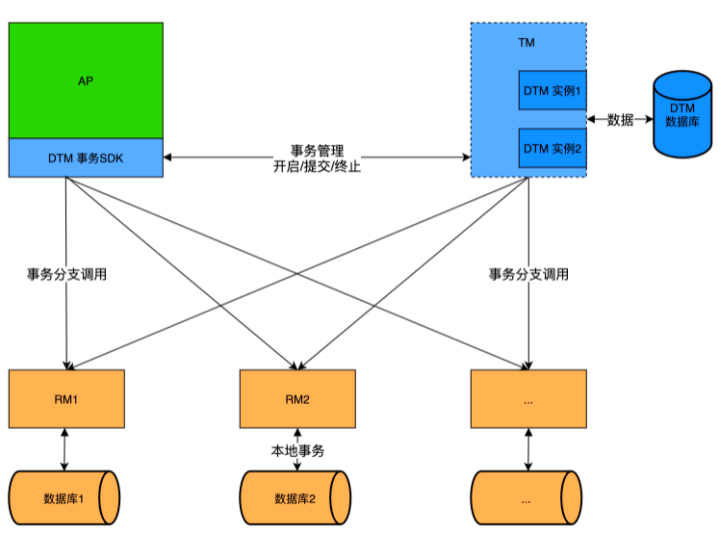
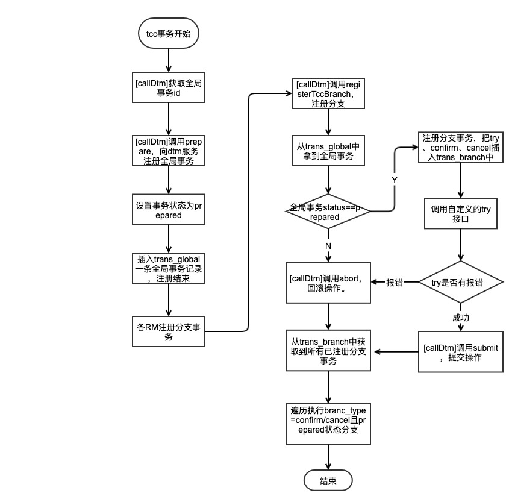

## dtm分布式事务源码解读
现在大部分的业务都是分布式部署，可能还是多个微服务的架构。那么我们就需要保证在分布式场景下，保障数据一致性。这就涉及到分布式事务技术。目前业界被大家应用最多的还是阿里开源的seata。但是由于seata是用java写的，而我们组是以golang为主导的技术栈。所以寻找一个golang为基础的分布式框架就很关键了。

dtm全名`distributed transaction manager`，是支持多语言的分布式事务技术。其客户端sdk支持多语言，主要是以golang为，其服务端则是golang语言写的服务，这就很符合我们的情况。从2021年6月份开源到现在，已经有项目3.5k个star。下面从源码的角度看看，dtm是怎么实现分布式的事务。

#### 基本原理
分布式事务说白了就是业务的所有操作，要么全部成功/要么全部失败，就像数据库事务一样，不过数据库事务是单点的，而分布式事务是多点的，也是要遵循最基本的ACID特性。基本的实现分布式事务的模式有SAGA、TCC、XA、消息事务等。这里不一一讲述这几种模式的流程，有兴趣的同学可以参考[这篇博客](https://segmentfault.com/a/1190000040321750)。

#### dtm架构


1. 从图中可以看到，dtm主要是分为客户端/服务端。客户端支持多种语言，服务端则以golang为基础的服务
2. AP是指我们应用Application，需要接入【DTM事务SDK】，并且与TM通信，注册【全局事务】和【各分支事务】
3. TM则是开启的dtm服务，本身是无状态的，可以支持高可用部署，需要有本地的【DTM数据库】作为基础。主要存储【全局事务】、【分支事务】以及【事务屏障】
4. RM是指各种目标资源，即我们需要保证数据一致性的微服务/多数据库等
5. dtm客户端和服务端之前支持http/grpc两种通信方式

一句话概括dtm架构就是AP应用向dtm服务注册各种事务分支，dtm根据不同模式来协调一个事务中的所有子事务分支作用在RM上，实现全部成功/全部回滚，来达到一致性的目的。


#### TCC事务流程
首先来看看TCC事务流程：
	
	
从图中可以看出，tcc整体分为try、confirm、cancel三个步骤：
>  
	- Try 阶段：尝试执行，完成所有业务检查（一致性）, 预留必须业务资源（准隔离性）
	- Confirm 阶段：如果所有分支的Try都成功了，则走到Confirm阶段。Confirm真正执行业务，不作任何业务检查
	- Cancel 阶段：如果所有分支的Try有一个失败了，则走到Cancel阶段。Cancel释放 Try 阶段预留的业务资源

#### 代码解读
根据上面的事务模型，下面从代码维度来看看tcc的实现。

> 代码版本为v1.1.0，由于作者更新活跃，追不上最新的版本，实现的思想上应该是差不多的。

##### 1. 申请全局事务id
```golang
gid := dtmcli.MustGenGid(DtmServer)
```

- 向DtmServer即dtm服务地址发送/newGid请求，申请全局事务唯一id（几乎所有的模式都有这一步）。
- dtm服务端默认IP+snowflake雪花算法生成唯一的id，实际上作者建议替换成各项目的唯一id，在我们组的话可以使用requestid

##### 2. 开启tcc事务
```golang
func TccGlobalTransaction(dtm string, gid string, tccFunc TccGlobalFunc) (rerr error) {
    tcc := &Tcc{TransBase: *NewTransBase(gid, "tcc", dtm, "")}
    rerr = tcc.callDtm(tcc, "prepare")
    if rerr != nil {
        return rerr
    }
    defer func() {
        x := recover()
        operation := If(x == nil && rerr == nil, "submit", "abort").(string)
        err := tcc.callDtm(tcc, operation)
        if rerr == nil {
            rerr = err
        }
        if x != nil {
            panic(x)
        }
    }()
    resp, rerr := tccFunc(tcc)
    rerr = CheckResponse(resp, rerr)
    return
}
```
- `TccGlobalTransaction `直接就是开启一个tcc全局事务，会调用`callDtm`的prepare接口，该接口是dtm服务暴露的接口，具体如下：

	```golang
	func prepare(c *gin.Context) (interface{}, error) {
	    t := TransFromContext(c)
	    t.Status = dtmcli.StatusPrepared
	    t.saveNew(dbGet())
	    return dtmcli.MapSuccess, nil
	}
	```
	- 其中`saveNew`会把【全局事务】入库；同时对于某些模式例如saga，也会入库【分支事务】。
- tccFunc是我们外部定义的函数，一般是定义`try-confirm-cancel`子事务分支。当`tccFunc`正常返回时，我们就会调用tcc的submit提交事务，看下`tccFunc`进行如下操作：

	```golang
	func(tcc *dtmcli.Tcc) (*resty.Response, error) {
            resp, err := tcc.CallBranch(&TransReq{Amount: 30}, Busi+"/TccBTransOutTry", Busi+"/TccBTransOutConfirm", Busi+"/TccBTransOutCancel")
            if err != nil {
                return resp, err
            }
            return tcc.CallBranch(&TransReq{Amount: 30}, Busi+"/TccBTransInTry", Busi+"/TccBTransInConfirm", Busi+"/TccBTransInCancel")
        }
	```
- 通过内部调用`CallBranch`来定义两个分支子事务`TccBTransOutTry`和`TccBTransInTry`，以及对应的`confirm`和`cancel`函数。当完成`CallBranch`后，实际上就完成了向dtm注册分支事务，并成功调用try。

##### 3.注册分支事务
完成了全局事务分支的注册后，通过`CallBranch`函数可以注册所有子事务的分支事务：

		func (t *Tcc) CallBranch(body interface{}, tryURL string, confirmURL string, cancelURL string) (*resty.Response, error) {
		    branchID := t.NewBranchID()
		    err := t.callDtm(&M{
		        "gid":         t.Gid,
		        "branch_id":   branchID,
		        "trans_type":  "tcc",
		        "data":        string(MustMarshal(body)),
		        BranchTry:     tryURL,
		        BranchConfirm: confirmURL,
		        "cancel":      cancelURL,
		    }, "registerTccBranch")
		    if err != nil {
		        return nil, err
		    }
		    resp, err := RestyClient.R().
		        SetBody(body).
		        SetQueryParams(MS{
		            "dtm":         t.Dtm,
		            "gid":         t.Gid,
		            "branch_id":   branchID,
		            "trans_type":  "tcc",
		            "branch_type": BranchTry,
		        }).
		        Post(tryURL)
		    return resp, CheckResponse(resp, err)
		}
		
- 调用`callDtm`的registerTccBranch接口，并注册try/confirm/cancel分支，入库到本地数据库。
- 调用`tryURL`接口，进行资源预留操作。注册和try操作都无误后，则该子事务操作成功

##### 4.事务提交
上面的开启全局事务后，有个defer操作。这里是决定执行submit还是abort，即成功还是回滚。dtm服务具体submit操作：

```golang
func svcSubmit(t *TransGlobal, waitResult bool) (interface{}, error) {
	# 忽略部分代码
    t.Status = dtmcli.StatusSubmitted
    t.saveNew(db)
    return t.Process(db, waitResult), nil

}
```
- 可以看到`submit`也会调用`saveNew`,并不是所有模式都会调用`prepare`的，所以通过submit也可以注册全局事务例如saga。
- `submit`最主要是实现`Process`。其是一个代理方法，具体执行各个模式的`ProcessOnce`和监控打点操作（有需要的话）
- `ProcessOnce`是各种模式自定义实现的方法，根据自身的策略来调用子分支事务，例如tcc：

	```golang
	func (t *transTccProcessor) ProcessOnce(db *common.DB, branches []TransBranch) {
	    if t.Status == dtmcli.StatusSucceed || t.Status == dtmcli.StatusFailed {
	        return
	    }
	    branchType := dtmcli.If(t.Status == dtmcli.StatusSubmitted, dtmcli.BranchConfirm, dtmcli.BranchCancel).(string)
	    for current := len(branches) - 1; current >= 0; current-- {
	        if branches[current].BranchType == branchType && branches[current].Status == dtmcli.StatusPrepared {
	            t.execBranch(db, &branches[current])
	        }
	    }
	    t.changeStatus(db, dtmcli.If(t.Status == dtmcli.StatusSubmitted, dtmcli.StatusSucceed, dtmcli.StatusFailed).(string))
	}
	```	
	- branches会传入所有的分支事务。遍历所有的分支事务，如果状态是`submit`的话，则仅执行子事务的confirm分支。execBranch会调用分支事务的接口，并修改状态
	- 所有分支事务处理完后，则修改全局事务的状态
	- 注意：这里不管分支事务是否成功，如果失败的话，dtm会有后台重试策略，直到成功为止

#### 流程图
经过上面的处理，`try-confirm`分支的业务处理，dtm本地数据库入库记录等操作都已完成，整个tcc事务就算处理完了。整体的流程可以归结为：

1. 注册全局事务和子分支事务，dtm服务会入库保存，由于后续的提交/回滚
2. dtm客户端（即我们的应用）执行try操作
3. dtm服务端根据入库的分支，执行confirm分支操作

整体的流程图如下：


#### 注意事项
1. dtm各种模式的代码都进行了高度封装，实际上每个模式只需要实现transProcessor接口：

	```golang
	type transProcessor interface {
		// 获取对应的分支事务
	    GenBranches() []TransBranch
	    // 成功/回滚具体处理
	    ProcessOnce(db *common.DB, branches []TransBranch)
	}
	```
2. 实际上dtm并不能够开箱即用。在与dtm服务端通信时，默认是以返回的内容是否包含"succeed/failed"等字符串来判断调用是否成功。
	
	```golang
	if strings.Contains(body, dtmcli.ResultSuccess) {
        t.touch(db, config.TransCronInterval)
        branch.changeStatus(db, dtmcli.StatusSucceed)
        branchMetrics(t, branch, true)
    }
	```
3. dtm客户端和服务端之间http的调用使用的是[retry-go](https://github.com/avast/retry-go)，该包提供重试，切面等处理。如果需要改成用原生http包的话，要改动的代码比较多。

#### 子事务屏蔽
在分布式处理过程中，可能由于网络异常，可能会出现重复请求，或者try还未执行，cancel就已经执行的情况。在分布式中称为空补偿、幂等、悬挂等问题。

dtm使用独创的子事务屏障技术，过滤不正常的请求。使得开发者不用太多关于异常的处理，安心写业务逻辑就好。使用子事务屏障也很简单，只需要调用`Call`函数，并在里面写自己的业务逻辑即可：

```golang
    return dtmcli.MapSuccess, barrier.Call(txGet(), func(db dtmcli.DB) error {
    	 // 业务逻辑
        return adjustTrading(db, transInUID, req.Amount)
    })
```

-  dtm在本地数据库中维护一张`barrier`表，其中唯一键为【全局事务id-子事务id-子事务分支名称】。通过主键特性，每完成一个子事务，就插入一条对应的记录。根据影响的行数，来判断分支事务的操作是否执行过。例如tcc:
	- 如果是try分支，则那么insert ignore插入gid-branchid-try，如果成功插入，则执行业务逻辑
	-	如果是confirm分支，那么insert ignore插入gid-branchid-confirm，如果成功插入，则执行业务逻辑
	- 如果是cancel分支，那么insert ignore插入gid-branchid-try，再插入gid-branchid-cancel，如果try未插入并且cancel插入成功，则执行业务逻辑
	
	> 当执行cancel时，发现可以插入try分支成功，则说明try还未执行，则属于异常返回。
	> 当插入的row为0说明本次分支已经插入过，属于重复请求返回。

子事务屏障整体流程如下：


#### 重试策略
dtm提供了后台重试的方法。当全局事务由于某些组件导致临时故障，那么全局事务会暂时中断，后续dtm会定时轮询未完成的全局事务，进行重试。一般多次重试则间隔每次加倍

```js
// CronTransOnce cron expired trans. use expireIn as expire time
func CronTransOnce(expireIn time.Duration) bool {
    defer handlePanic(nil)
    trans := lockOneTrans(expireIn)
    if trans == nil {
        return false
    }
    trans.Process(dbGet(), true)
    return true
}
```

1. `lockOneTrans`会从【全局事务】表中拿一条未执行完成的事务，并直接调用对应的Process来重试业务逻辑
2. `lockOneTrans`中操作比较简单粗暴，拿出1小时内未执行的事务，并指数增加间隔次数。实际上各个系统都会有自己重试的策略，这里可以按照自身的需求进行修改。

#### 总结
1. dtm实际上不可以开箱即用，需要其整体的分布式思想下，对一些日志的打点，接口调用成功与否的判断，数据库driver模型选择等都要根据自己项目的使用情况做二次开发。
2. confirm是有dtm服务端发起的，dtm是支持异步操作的，由于异步执行结果未知，作者建议自行添加重试和监控。
3. 如果接入dtm的话，我们的业务也需要拆分成各个模块，对应不同的分支，提供给dtm服务端调用。
3. 作者正在大力推广dtm，三个星期不到的时间项目更新了3次版本，同时正在和go-zero项目组进行对接。有兴趣的同学可以一起探讨。

#### 参考文献
[https://github.com/yedf/dtm](https://github.com/yedf/dtm)
