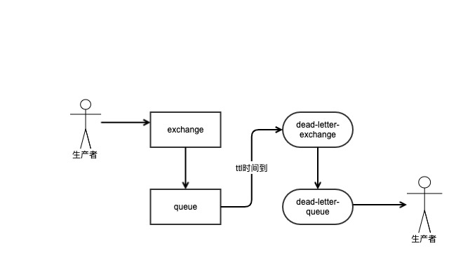

### rabbitmq

#### 死信队列
当消息在一个队列中变成死信之后，它能重新被发送到另一个交换机中，这个交换机就是 死信交换机，绑定死信交换机 的队列就称之为死信队列

1. 消息变成死信有这几种情况
	- 消息被否定确认
	- 消息的存活时间超过设置的最大TTL时间
	- 消息队列的长度已经超过最大长度

可以被任何一个队列指定，被指定成死信交换机的时候，会设置 x-dead-letter-exchange属性，并且会设置对应的路由键 x-dead-letter-routing-key

#### 延迟队列
消息发送到队列之后，并不期望消费者能马上消费，也是延迟一段时间之后，才拿到该消息进行消费。
延迟队列我们是使用【死信队列】和【TTL】来模拟 延迟队列的，如下图：



1. dead-letter-queue的消息，会继承queue中的属性，例如原本消息的持久化的，那么延迟后的消息也是持久化的。

代码整体队列声明:

```golang
	// 1. 定义延迟队列，消息到期后进入死信队列
	ch.ExchangeDeclare(
		delayExchangeName, // name
		"direct",                  // kind
		true,                      // durable
		false,                     // autoDelete
		false,                     // internal
		false,                     // noWait
		nil,                       // args
	)

	ch.QueueDeclare(
		delayQueueName, // name
		true,                   // durable
		false,                  // autoDelete
		false,                  // exclusive
		false,                  // noWait
		amqp.Table{
			"x-dead-letter-exchange":    consumeExchangeName,
			"x-dead-letter-routing-key": consumeRoutingKey,
		},
	)

	p.ch.QueueBind(
		delayQueueName,    // queue name
		delayRoutingKey,   // queue key
		delayExchangeName, // exchange name
		false,
		nil,
	)

	// 2. 定义死信队列(消费队列)
	p.ch.ExchangeDeclare(
		consumeExchangeName, // name
		"direct",                    // kind
		true,                        // durable
		false,                       // autoDelete
		false,                       // internal
		false,                       // noWait
		nil,                         // args
	)

	p.ch.QueueDeclare(
		consumeQueueName, // name
		true,                     // durable
		false,                    // autoDelete
		false,                    // exclusive
		false,                    // noWait
		nil,                      // args
	)

	p.ch.QueueBind(
		consumeQueueName,    // queue name
		consumeRoutingKey,   // queue key
		consumeExchangeName, // exchange name
		false,
		nil,
	)

```
